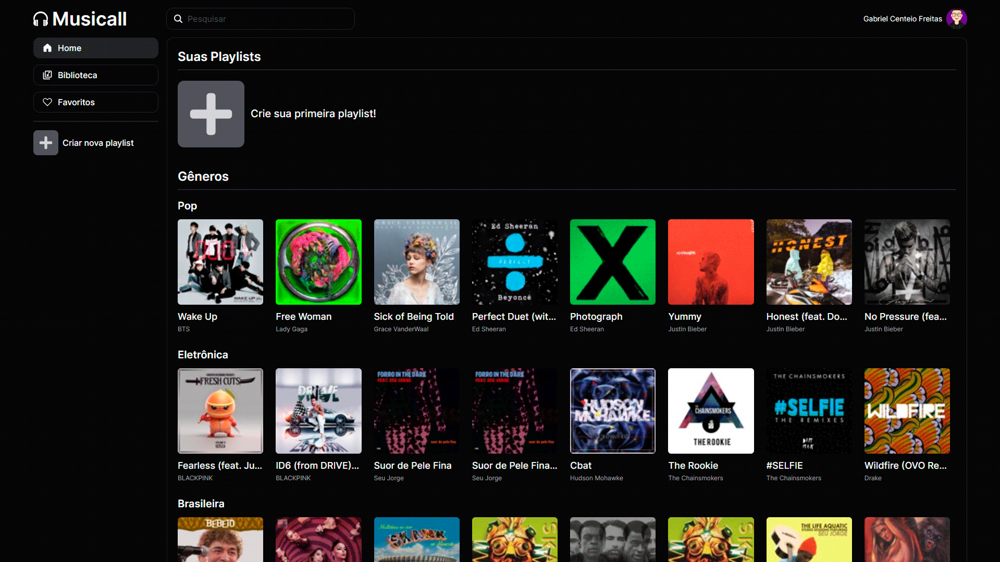

<h1 align="center">Musicall</h1>

  <h3 align="left">Front-end</h3>
  

    
    
    
    
    
  

  
  <h3 align="left">Back-end</h3>
  

    
    
    
    
    
    
  

 

  
  

<h4 align="center">
  
  [Ver projeto](https://musicall-project.vercel.app/)
</h4>

 

  <a href="#projeto">Sobre o projeto</a> •
  <a href="#tecnologias">Tecnologias</a>

## 💻 Sobre o projeto

Esse é o repositório do front-end de um projeto pessoal Full-stack. Para acessar o repositório do back-end, clique [aqui](https://github.com/GabrielCenteioFreitas/Musicall-backend).

O projeto é um site inspirado no Spotify, com diversas funcionalidades, como:
- Login com o Google
- Edição de perfil
- Reprodução de músicas em modo sequencial, aleatório ou em loop
- Criação de playlists
- Edição de título, descrição e privacidade das playlists
- Adição de foto personalizada nas playlists
- Adição de músicas nas playlists
- Marcação de músicas, álbuns ou artistas como favoritos

Caso queira ver o projeto, clique [aqui](https://musicall-project.vercel.app/).

## 🚀 Tecnologias

O front-end desse projeto foi desenvolvido com as seguintes tecnologias:

- ReactJS
- NextJS
- Typescript
- TailwindCSS
- Shadcn/ui
- iTunes API

## 🤝 Contribuições

Issues e pull requests são muito bem-vindos!

## 👨🏻‍💻 Autor: Gabriel Centeio Freitas 

  
  

